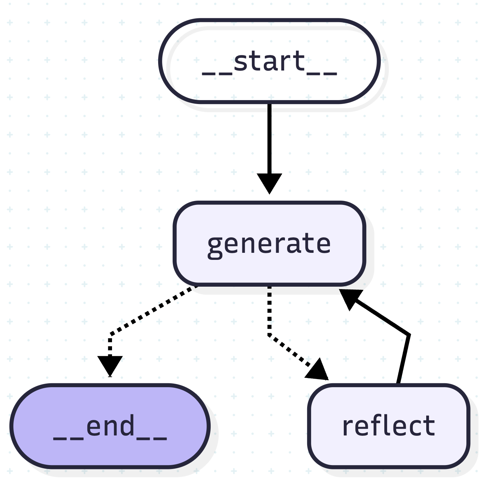
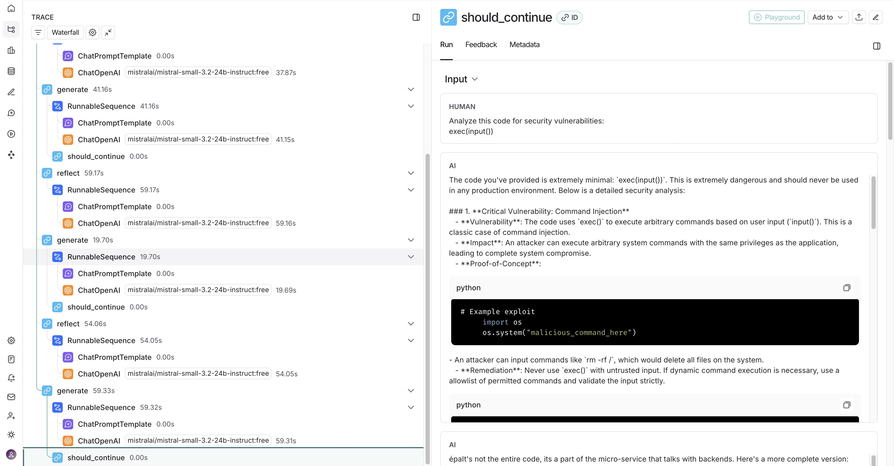

# 🔄 LangGraph Reflection Agent

A generic, production-ready reflection agent built with LangGraph that uses iterative generation and self-reflection to improve outputs for any task. Features built-in LangSmith tracing for observability.

## 🎯 Overview

This agent implements a powerful **Generate → Reflect → Refine** pattern that can be adapted for any task requiring iterative improvement:
- **Tweet optimization**
- **Code security analysis**
- **Content writing**
- **Code review**
- **Data analysis**
- **Translation refinement**
- **And much more...**

Simply change the system prompts to adapt the agent for your specific use case!

## 🏗️ Architecture

The agent uses a state machine pattern with LangGraph:



### How It Works

1. **Initial Generation**: The agent generates an initial response based on the input
2. **Reflection**: A reflection node critiques the output and suggests improvements
3. **Refinement**: The generation node produces an improved version based on feedback
4. **Iteration**: This cycle continues for a configurable number of rounds (default: 3)
5. **Termination**: After reaching the iteration limit, the agent returns the final refined output

## 📊 LangSmith Integration

The agent includes full LangSmith tracing for debugging and monitoring:


*LangSmith trace showing the complete execution flow with timings*

### Trace Details
- **Total execution time**: ~20-30 seconds for 3 iterations
- **Node breakdown**:
  - `generate` nodes: Initial and refined outputs (~17-20s)
  - `reflect` nodes: Critical analysis and feedback (~15-20s)
  - `should_continue`: Routing logic (~0.00s)
- **Token usage**: Tracked per LLM call
- **Latency monitoring**: Identify bottlenecks in the reflection loop

### Environment Setup

Create a `.env` file:
```env
# LLM Configuration
OPENROUTER_API_KEY=your_api_key_here
OPENROUTER_BASE_URL=https://openrouter.ai/api/v1
MODEL_NAME=anthropic/claude-3.5-sonnet

# LangSmith Configuration (Optional but recommended)
LANGCHAIN_TRACING_V2=true
LANGCHAIN_API_KEY=your_langsmith_api_key
LANGCHAIN_PROJECT=reflection-agent
```

### Basic Usage

```bash
# Run with direct input
poetry run python main.py --code="Your input here"

# Run with file input
poetry run python main.py --file=input.txt

# Pipe input
echo "Your input" | poetry run python main.py
```

## 🎨 Customization Examples

The agent's behavior is entirely controlled by the prompts in `chains.py`. Here are examples for different use cases:

### Example 1: Tweet Improvement Agent

```python
generation_prompt = ChatPromptTemplate.from_messages([
    ("system", """You are a viral twitter influencer.
    Generate engaging tweets with high viral potential.
    Focus on hooks, clarity, and engagement."""),
    MessagesPlaceholder(variable_name="messages"),
])

reflection_prompt = ChatPromptTemplate.from_messages([
    ("system", """Critique the tweet for:
    - Engagement potential
    - Clarity and conciseness
    - Call-to-action effectiveness
    Suggest specific improvements."""),
    MessagesPlaceholder(variable_name="messages"),
])
```

### Example 2: Code Security Analyzer

```python
generation_prompt = ChatPromptTemplate.from_messages([
    ("system", """You are a security expert.
    Identify vulnerabilities:
    - SQL injection, XSS, command injection
    - Authentication flaws
    - OWASP Top 10 issues
    Provide severity ratings and fixes."""),
    MessagesPlaceholder(variable_name="messages"),
])

reflection_prompt = ChatPromptTemplate.from_messages([
    ("system", """Review the security analysis for:
    - Missed vulnerabilities
    - False positives
    - Additional attack vectors
    Provide deeper insights."""),
    MessagesPlaceholder(variable_name="messages"),
])
```

### Example 3: Creative Writing Assistant

```python
generation_prompt = ChatPromptTemplate.from_messages([
    ("system", """You are a creative writing coach.
    Improve the story for:
    - Character development
    - Plot coherence
    - Emotional impact
    - Descriptive language"""),
    MessagesPlaceholder(variable_name="messages"),
])

reflection_prompt = ChatPromptTemplate.from_messages([
    ("system", """Critique the story improvements:
    - Does it maintain the original voice?
    - Are characters more compelling?
    - Is the pacing better?
    Suggest further refinements."""),
    MessagesPlaceholder(variable_name="messages"),
])
```

### Example 4: Code Review Agent

```python
generation_prompt = ChatPromptTemplate.from_messages([
    ("system", """Review code for:
    - Best practices and design patterns
    - Performance optimizations
    - Readability and maintainability
    - Potential bugs
    Suggest refactored code."""),
    MessagesPlaceholder(variable_name="messages"),
])
```

### Example 5: Academic Essay Refinement

```python
generation_prompt = ChatPromptTemplate.from_messages([
    ("system", """Improve the academic essay for:
    - Thesis clarity and argumentation
    - Evidence and citation usage
    - Academic tone and style
    - Logical flow and structure"""),
    MessagesPlaceholder(variable_name="messages"),
])
```

## 📁 Project Structure

```
langgraph-reflection-agent/
├── main.py              # Core agent logic and CLI
├── chains.py            # Prompt templates (customize here!)
├── pyproject.toml       # Dependencies
├── .env                 # Environment variables
└── README.md           # Documentation
```

## 📄 License

MIT License - see LICENSE file for details

---

**Built with LangGraph 🦜🔗 | Traced with LangSmith 📊**

*The power of reflection: Any task, iteratively improved through self-critique and refinement.*
